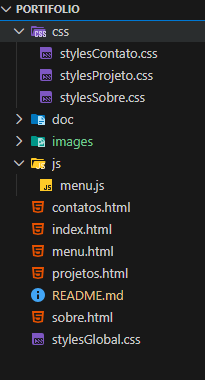
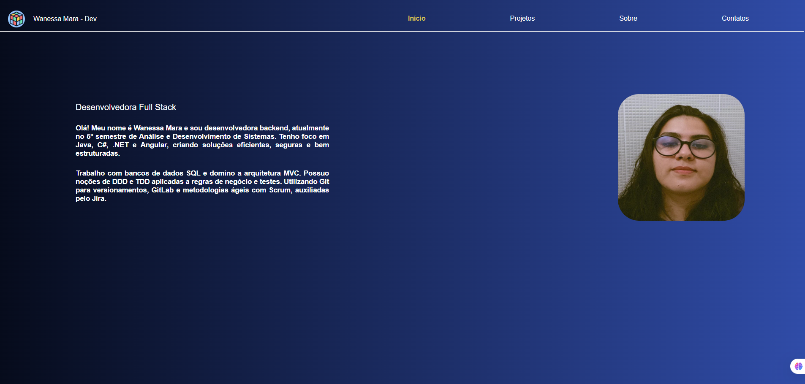
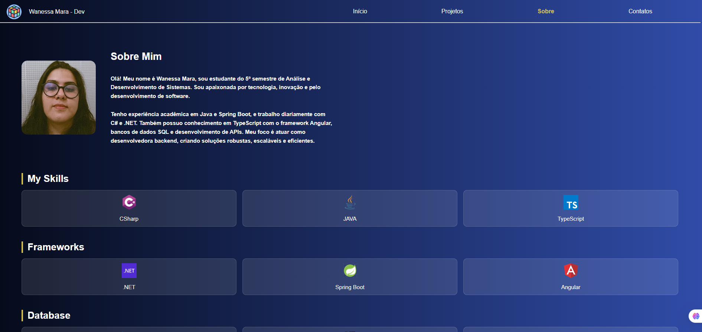
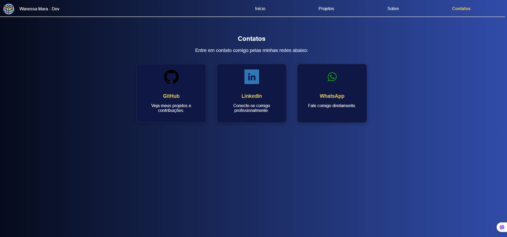

# Portfólio
Este é meu portfólio, onde apresento meus projetos e habilidades como desenvolvedora. 

## 🌐 Demonstração

👉 [Clique aqui para ver o portfólio](https://wanessamara.github.io/Portfolio/)

> 💡 Dica: Clique com o botão direito e selecione “abrir em nova guia” para manter esta página aberta.

## 🛠️ Tecnologias Usadas
- **HTML5**: Estrutura das páginas
- **CSS3**: Estilização e layout responsivo
- **JAVASCRIPT**: Interatividade e manipulação do DOM
- **GitHub Pages**: Hospedagem do potifólio

## 📂 Estrutura do Projeto

## 📸 Capturas de Telas

